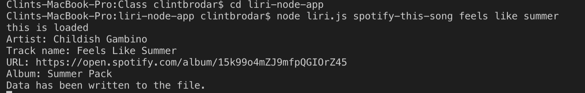
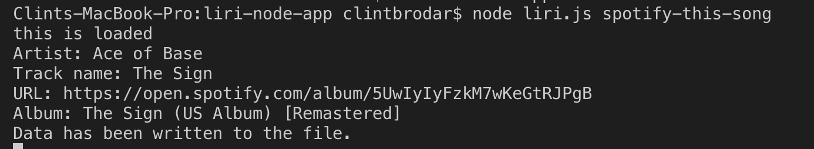
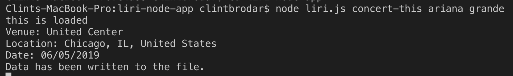
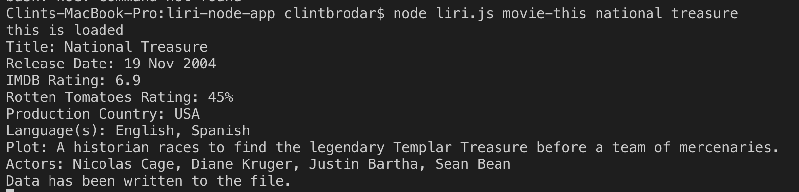
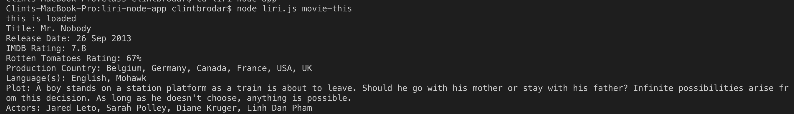
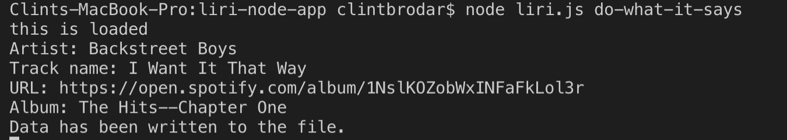
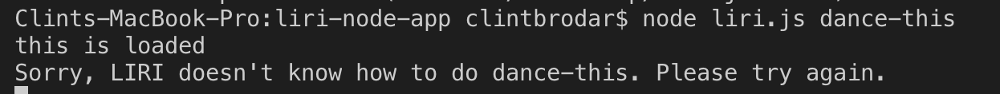
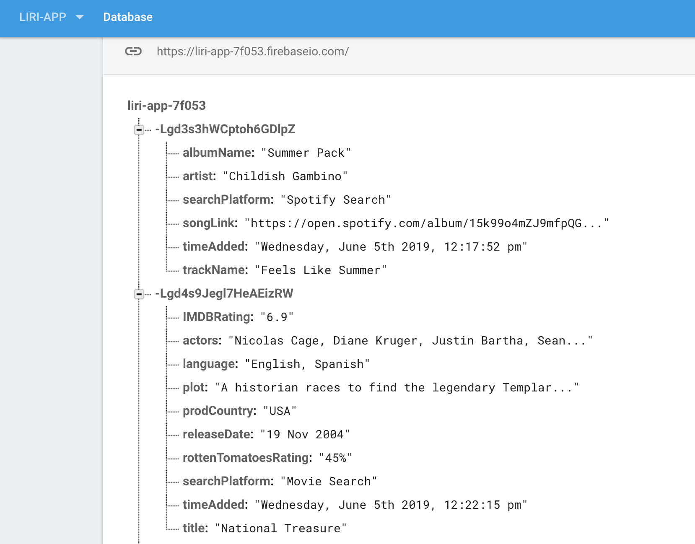
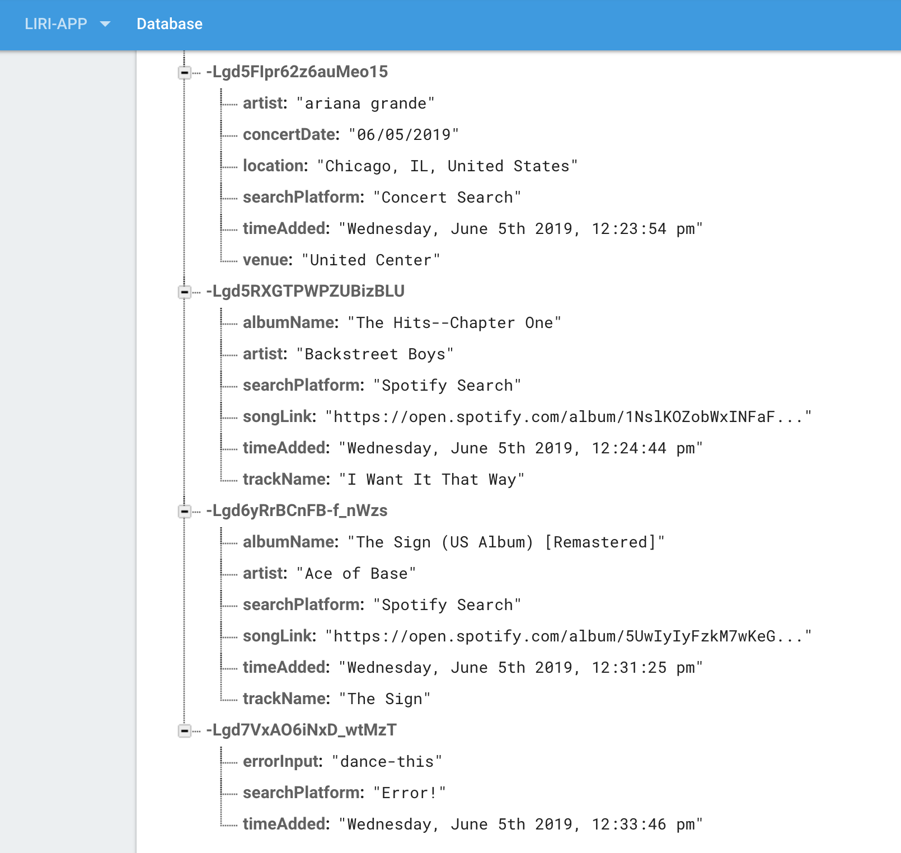

LIRI (Language Interpretation and Recognition Interface) is a command line node app that will search Spotify for songs, Bands in Town for concerts and OMDB for movie.

For Spotify, the user types in node liri.js spotify-this-song 'song name here' and it outputs the following:

* Artist(s)
* The song's name
* A preview link of the song from Spotify
* The album that the song is from

If no song is typed in, it will default to the information for "The Sign" by Ace of Base

For Bands in Town, the user types in node liri.js concert-this 'artist/band name here' and it outputs the following:
* Name of the venue
* Venue location
* Date of the Event

For OMDB, the user types in node liri.js movie-this 'movie name here' and it outputs the following:
* Title of the movie
* Year the movie came out
* IMDB Rating of the movie
* Rotten Tomatoes Rating of the movie
* Country where the movie was produced
* Language of the movie
* Plot of the movie
* Actors in the movie

If no movie is typed in, it will default to the information for the movie "Mr. Nobody"

If the user types in "do-what-it-says", LIRI will run the spotify-this-song function with the contents of the random.txt file.

If the user types in a search that is not recognized, LIRI outputs "Sorry, LIRI doesn't know how to do " + <User Search> + ". Please try again."

* All the results of the searches are logged to the log.txt file 
* Data is also stored in Firebase
    - A timestamp is added

